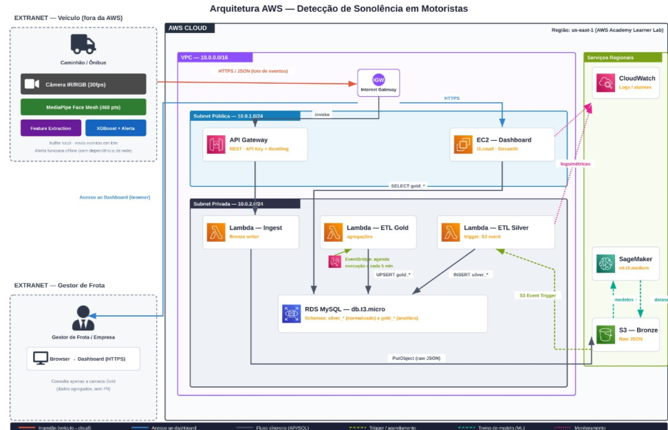

# DriveGuard — Infraestrutura AWS (Terraform)

Infraestrutura como código do **DriveGuard**, sistema de detecção de sonolência em
motoristas de caminhões e ônibus (TCC 2026).

Um `terraform apply` provisiona a nuvem inteira: rede, ingestão, armazenamento,
banco com o schema já criado e populado, pipeline de ETL agendado, dashboard e
monitoramento.



---

## Índice

1. [O que este repositório provisiona](#1-o-que-este-repositório-provisiona)
2. [Fluxo de dados](#2-fluxo-de-dados)
3. [Decisões de arquitetura](#3-decisões-de-arquitetura)
4. [Estrutura do repositório](#4-estrutura-do-repositório)
5. [Pré-requisitos](#5-pré-requisitos)
6. [Como rodar no AWS Academy Learner Lab](#6-como-rodar-no-aws-academy-learner-lab)
7. [Validando a esteira ponta a ponta](#7-validando-a-esteira-ponta-a-ponta)
8. [Modelo de dados](#8-modelo-de-dados)
9. [Custo](#9-custo)
10. [Operação do dia a dia](#10-operação-do-dia-a-dia)
11. [Segurança e LGPD](#11-segurança-e-lgpd)
12. [Solução de problemas](#12-solução-de-problemas)
13. [Destruindo o ambiente](#13-destruindo-o-ambiente)
14. [Limitações conhecidas](#14-limitações-conhecidas)

---

## 1. O que este repositório provisiona

| Camada | Recurso AWS | Papel na solução |
|---|---|---|
| Rede | VPC `10.0.0.0/16`, IGW, 2 subnets públicas, 2 privadas, VPC Endpoints | Isola o banco e as Lambdas da internet |
| Ingestão | API Gateway REST + API Key + Usage Plan | Recebe os lotes HTTPS enviados pelo veículo |
| Ingestão | Lambda `ingest` | Grava o JSON cru no S3 Bronze |
| Bronze | S3 versionado, cifrado, com lifecycle | Evento imutável e auditável |
| Silver | Lambda `etl-silver` (gatilho S3) | Normaliza e carrega no PostgreSQL |
| Silver/Gold | RDS PostgreSQL `db.t3.micro` | 12 tabelas OLTP + 7 MATERIALIZED VIEWs |
| Gold | Lambda `etl-gold` + EventBridge (5 min) | `REFRESH MATERIALIZED VIEW CONCURRENTLY` |
| Schema | Lambda `db-migrate` | Aplica o DDL e o seed no `apply` |
| Apresentação | EC2 `t3.small` + Elastic IP + nginx | Hospeda o dashboard DriveGuard |
| ML | SageMaker Notebook `ml.t3.medium` *(opcional)* | Treino dos modelos (XGBoost / YOLO) |
| Observabilidade | CloudWatch (alarmes + dashboard), SNS, SQS DLQ | Monitora a cadeia inteira |

O processamento de visão computacional **não** está aqui: ele roda no dispositivo
embarcado no veículo (MediaPipe Face Mesh → extração de features → classificador →
alerta local). Esta infraestrutura começa no ponto em que o veículo já decidiu o
estado do motorista e envia apenas métricas numéricas anonimizadas.

---

## 2. Fluxo de dados

```
┌──────────────────────── VEÍCULO (edge, fora da AWS) ─────────────────────────┐
│  Câmera IR/RGB 30fps → MediaPipe Face Mesh (468 landmarks)                   │
│  → EAR, MAR, PERCLOS, blink rate, head pose (solvePnP)                       │
│  → classificador (XGBoost) → alerta / fadiga / sonolento                     │
│  → ALERTA LOCAL sonoro+visual (funciona offline)                             │
│  → buffer local; envia lote HTTPS quando há rede                             │
└────────────────────────────────────┬─────────────────────────────────────────┘
                                     │ POST /v1/eventos  (x-api-key)
                                     ▼
                         ┌───────────────────────┐
                         │  API Gateway (REST)   │  throttling + quota
                         └───────────┬───────────┘
                                     ▼
                         ┌───────────────────────┐
                         │  Lambda ingest        │  fora da VPC (só fala com S3)
                         │  valida + envelopa    │
                         └───────────┬───────────┘
                                     ▼
                  ┌──────────────────────────────────────┐
                  │  S3 BRONZE                           │
                  │  eventos/dt=YYYY-MM-DD/hr=HH/…json   │  imutável, versionado
                  └──────────────────┬───────────────────┘
                                     │ s3:ObjectCreated:*
                                     ▼
                         ┌───────────────────────┐
                         │  Lambda etl-silver    │  subnet PRIVADA
                         │  resolve FKs, dedup   │
                         └───────────┬───────────┘
                                     ▼
                  ┌──────────────────────────────────────┐
                  │  RDS PostgreSQL                      │
                  │  schema silver  (12 tabelas OLTP)    │
                  │  schema gold    (7 MATERIALIZED VIEWs)│
                  └───────┬──────────────────────┬───────┘
                          │                      ▲
        EventBridge 5 min │                      │ REFRESH CONCURRENTLY
                          ▼                      │
                    ┌───────────────────────┐    │
                    │  Lambda etl-gold      │────┘
                    └───────────────────────┘
                                     │
                                     ▼
                         ┌───────────────────────┐
                         │  EC2 t3.small + nginx │  subnet PÚBLICA
                         │  Dashboard DriveGuard │  ← gestor de frota (browser)
                         └───────────────────────┘
```

**Dados ao vivo não passam pelo Gold.** Os painéis "Alertas em Tempo Real",
"Ações Rápidas" e "Insights" leem a Silver diretamente; só as agregações
históricas vêm das MVs, que têm até 5 minutos de atraso.

---

## 3. Decisões de arquitetura

Estas são as escolhas que exigiram justificativa — cada uma resolve uma restrição
concreta do projeto.

### 3.1 PostgreSQL, não MySQL

A dissertação (versão inicial) menciona "Amazon RDS com MySQL". Aqui foi usado
**PostgreSQL**, e essa mudança é deliberada:

- a camada Gold é feita de `MATERIALIZED VIEW` com `REFRESH CONCURRENTLY`, que
  **não existe no MySQL** — no MySQL seria preciso recriar tabelas agregadas a
  cada ciclo, com janela de indisponibilidade a cada refresh;
- o modelo usa `UUID`, `JSONB`, `TIMESTAMPTZ`, `ENUM` via `CREATE TYPE` e
  índices parciais — todos nativos no PostgreSQL;
- o time do dashboard já definiu o schema em PostgreSQL.

O documento de contexto do TCC (`CONTEXTO_TCC.md`, seção 9) registra essa decisão.
**O diagrama `docs/arquitetura-aws.png` ainda diz "RDS MySQL" e está desatualizado
nesse ponto** — vale corrigir antes da entrega final.

### 3.2 Sem NAT Gateway

As Lambdas de ETL rodam em subnet privada e precisam alcançar S3 e CloudWatch
Logs. O caminho óbvio seria um NAT Gateway, mas ele custa **~US$32/mês + tráfego**:
um terço do orçamento de US$100 do Learner Lab, gasto em encanamento.

A solução usa VPC Endpoints:

| Serviço | Tipo de endpoint | Custo |
|---|---|---|
| S3 | Gateway | **grátis** |
| CloudWatch Logs | Interface (1 ENI por subnet privada) | ~US$0,01/h por ENI |

Sem o endpoint de Logs, uma Lambda em subnet privada sem NAT **trava no envio do
log e só aparece o timeout, sem stack trace** — um dos erros mais difíceis de
diagnosticar nessa topologia. Se quiser o NAT mesmo assim:
`enable_nat_gateway = true`.

### 3.3 A Lambda de ingestão fica fora da VPC

Ela só fala com o S3. Colocá-la na VPC custaria uma ENI e cold start de rede
sem nenhum ganho. As outras três Lambdas ficam na VPC porque precisam do RDS.

### 3.4 `iam_mode`: Learner Lab ou conta própria

O Learner Lab **nega `iam:CreateRole`**. Qualquer Terraform que tente criar roles
falha no primeiro apply. Por isso:

- `iam_mode = "learner_lab"` *(padrão)* — reutiliza a `LabRole` e o
  `LabInstanceProfile` já existentes;
- `iam_mode = "self_managed"` — o Terraform cria roles e policies dedicadas por
  serviço, com permissões mínimas (veja [`iam.tf`](iam.tf)).

O segundo modo não é enfeite: ele documenta, em código, exatamente quais
permissões a solução exige — material direto para o capítulo de segurança do TCC.

### 3.5 pg8000 no lugar de psycopg2

`psycopg2` tem extensão em C e precisaria ser compilado no Amazon Linux para
virar uma layer. `pg8000` é **100% Python puro**: `pip install --target` funciona
em Windows, macOS e Linux, e o build do repositório é reprodutível em qualquer
máquina do grupo.

### 3.6 SSM Parameter Store, não Secrets Manager

A senha do RDS é gerada pelo Terraform e guardada como `SecureString` no
Parameter Store. Parâmetros Standard são **gratuitos**; cada segredo no Secrets
Manager custa US$0,40/mês, e o acesso a partir de subnet privada exigiria mais um
VPC Endpoint de interface.

As Lambdas recebem a senha por variável de ambiente (cifrada em repouso pela
chave gerenciada da AWS para Lambda). A EC2 do dashboard, que tem saída para a
internet, lê a URI direto do Parameter Store no boot.

> Em produção o correto seria Secrets Manager com rotação automática. A troca
> está documentada aqui como decisão de custo, não como boa prática geral.

### 3.7 O refresh do Gold acontece em Python, não no banco

`REFRESH MATERIALIZED VIEW CONCURRENTLY` chama `PreventInTransactionBlock` no
PostgreSQL: ele **recusa rodar dentro de um bloco de transação** — e todo corpo de
função plpgsql é um. Uma função `fn_refresh_todas()` que fizesse o laço no banco
falharia em tempo de execução.

Por isso a Lambda `etl-gold` lê `gold.vw_materialized_views` e dispara um
`REFRESH` por statement, com a conexão em **autocommit**, medindo cada view
separadamente e publicando a duração como métrica no CloudWatch.

### 3.8 Toda MV tem índice UNIQUE sobre colunas sem NULL

`REFRESH CONCURRENTLY` exige um índice UNIQUE. Menos óbvio: um índice UNIQUE
**não desduplica linhas com NULL**, e o refresh aborta com
`contains duplicate rows`. Por isso as colunas de dimensão das views são
normalizadas com `COALESCE(...,'ND')` em vez de aceitar NULL.

### 3.9 Idempotência em duas camadas

O S3 pode reentregar o mesmo evento e o Lambda pode reprocessar depois de uma
falha parcial. A proteção é dupla:

1. `silver.ingestao_controle` registra cada objeto Bronze já processado;
2. constraints `UNIQUE (device_id, registrado_em)` em `leituras_fadiga` e
   `UNIQUE (motorista_id, disparado_em, tipo)` em `alertas`, com
   `ON CONFLICT DO NOTHING`.

Assim, reprocessar o bucket inteiro de propósito é seguro.

### 3.10 Elastic IP no dashboard

O Learner Lab **para as instâncias ao fim de cada sessão**. Sem EIP, o IP público
mudaria a cada retomada e o link entregue à banca deixaria de funcionar.

---

## 4. Estrutura do repositório

```
Infra/
├── main.tf                  # orquestração dos módulos
├── variables.tf             # todas as variáveis, com o porquê de cada default
├── locals.tf                # tags, AZs, resolução de IAM
├── iam.tf                   # roles (apenas em iam_mode = self_managed)
├── outputs.tf               # endpoints, credenciais, comandos de teste
├── providers.tf / versions.tf
├── terraform.tfvars.example # copie para terraform.tfvars
├── backend.tf.example       # backend S3 + lock DynamoDB (opcional)
├── Makefile                 # atalhos de operação
│
├── modules/
│   ├── network/             # VPC, subnets, IGW, SGs, VPC Endpoints
│   ├── storage/             # S3 Bronze + artefatos, lifecycle, upload do SQL
│   ├── database/            # RDS PostgreSQL, parameter group, SSM
│   ├── ingest/              # API Gateway + Lambda ingest
│   ├── etl/                 # Lambdas silver/gold/migrate, EventBridge, DLQ
│   ├── dashboard/           # EC2 + EIP + user_data (Node/nginx)
│   ├── ml/                  # SageMaker Notebook + autostop por ociosidade
│   └── observability/       # alarmes, SNS, dashboard do CloudWatch
│
├── lambdas/
│   ├── common/db.py         # conexão pg8000 com TLS validado e retry
│   ├── ingest/handler.py    # valida o lote e grava no Bronze
│   ├── etl_silver/handler.py# Bronze → schema silver
│   ├── etl_gold/handler.py  # REFRESH das MVs
│   └── db_migrate/handler.py# aplica os .sql do bucket de artefatos
│
├── sql/
│   ├── 01_schema_silver.sql # 12 tabelas, ENUMs, índices, triggers
│   ├── 02_views_gold.sql    # 7 MATERIALIZED VIEWs + catálogo
│   ├── 03_seed_demo.sql     # dados sintéticos de demonstração
│   └── 04_refresh_gold.sql  # primeira carga das MVs
│
├── scripts/
│   ├── build_lambdas.ps1    # empacotamento (Windows)
│   └── build_lambdas.sh     # empacotamento (Linux/macOS)
│
├── examples/evento.json     # payload de exemplo da API
└── docs/arquitetura-aws.png
```

---

## 5. Pré-requisitos

| Ferramenta | Versão | Para quê |
|---|---|---|
| Terraform | ≥ 1.6 | provisionar |
| Python | ≥ 3.11 | empacotar as Lambdas (`pip install --target`) |
| AWS CLI | v2 | credenciais e comandos operacionais |
| Git | qualquer | clonar o dashboard na EC2 |

No Windows:

```bash
winget install Hashicorp.Terraform Amazon.AWSCLI Python.Python.3.12
```

---

## 6. Como rodar no AWS Academy Learner Lab

### 6.1 Pegue as credenciais da sessão

No Learner Lab, clique em **AWS Details → AWS CLI → Show**. Copie o bloco e cole
em `~/.aws/credentials`:

```ini
[default]
aws_access_key_id=ASIA...
aws_secret_access_key=...
aws_session_token=...
```

> As credenciais **expiram quando a sessão do lab termina**. Se o `apply` falhar
> com `ExpiredToken`, é só copiar o bloco novo e rodar de novo — o state local
> continua válido.

Confirme:

```bash
aws sts get-caller-identity
```

### 6.2 Configure as variáveis

```bash
cp terraform.tfvars.example terraform.tfvars
```

Ajuste o que interessa. O mínimo recomendado é liberar o seu IP:

```bash
curl -s https://checkip.amazonaws.com
```

e colocar em `admin_cidrs = ["SEU.IP.AQUI/32"]`.

### 6.3 Provisione

```bash
terraform init
terraform plan
terraform apply
```

O `apply` executa, nesta ordem:

1. `null_resource.build_lambdas` roda `scripts/build_lambdas.ps1` (ou `.sh`):
   instala `pg8000` em `build/`, baixa o bundle de CAs do RDS e monta os pacotes;
2. cria VPC, subnets, security groups e VPC Endpoints;
3. cria os buckets e publica os `.sql` no bucket de artefatos;
4. cria o RDS **(esta etapa leva 8–12 minutos)**;
5. cria as Lambdas e o API Gateway;
6. invoca `db-migrate`, que aplica `01` → `04`: schema, views, seed e primeira
   carga das MVs;
7. sobe a EC2, que clona e builda o dashboard no `user_data`.

Tempo total típico: **12 a 18 minutos**, quase tudo esperando o RDS.

### 6.4 Pegue os endereços

```bash
terraform output resumo
terraform output -raw api_key_value
terraform output -raw db_connection_uri
```

---

## 7. Validando a esteira ponta a ponta

### 7.1 A API responde?

```bash
curl "$(terraform output -raw api_invoke_url)/health"
```

Esperado: `{"status": "ok", "servico": "driveguard-ingest"}`

### 7.2 Enviar um lote de eventos

```bash
curl -X POST "$(terraform output -raw api_eventos_endpoint)" \
  -H "x-api-key: $(terraform output -raw api_key_value)" \
  -H "Content-Type: application/json" \
  -d @examples/evento.json
```

Esperado: HTTP 202 com `ingest_id` e `bronze_key`.

### 7.3 O objeto chegou ao Bronze?

```bash
aws s3 ls "s3://$(terraform output -raw bronze_bucket)/eventos/" --recursive
```

### 7.4 O ETL Silver processou?

```bash
aws logs tail "/aws/lambda/$(terraform output -json lambdas | jq -r .etl_silver)" --since 5m
```

Procure por `Silver atualizada: key=... leituras=3 alertas=1`.

### 7.5 Os dados estão no banco?

Com `db_publicly_accessible = true` e o seu IP em `admin_cidrs`:

```bash
psql "$(terraform output -raw db_connection_uri)" \
  -c "SELECT estado, COUNT(*) FROM silver.leituras_fadiga GROUP BY estado;"
```

### 7.6 O Gold atualizou?

O EventBridge dispara a cada 5 minutos. Para não esperar:

```bash
aws lambda invoke \
  --function-name "$(terraform output -json lambdas | jq -r .etl_gold)" \
  --payload '{}' --cli-binary-format raw-in-base64-out /dev/stdout
```

Esperado: `{"views_atualizadas": 7, ...}` com a duração de cada view.

### 7.7 O dashboard está no ar?

```bash
curl -I "$(terraform output -raw dashboard_url)"
```

O build do dashboard leva alguns minutos após o `apply` terminar. Para acompanhar:

```bash
aws ssm start-session --target "$(terraform output -raw dashboard_instance_id)"
sudo tail -f /var/log/driveguard-bootstrap.log
```

---

## 8. Modelo de dados

Arquitetura **Medallion** em três camadas.

### Bronze — S3

JSON cru, imutável, versionado, particionado por data e hora:

```
s3://driveguard-dev-bronze-<sufixo>/eventos/dt=2026-03-14/hr=03/dg-edge-0001/<ts>-<uuid>.json
```

Cada objeto é um envelope com `ingest_id`, `ingest_timestamp`, IP de origem e o
`payload` original intacto. A Silver pode ser reconstruída do zero a partir daqui.

### Silver — `schema silver` (12 tabelas)

| Tabela | PK | Papel |
|---|---|---|
| `empresas` | UUID | Empresas de transporte |
| `usuarios` | UUID | Contas do dashboard (gestor/operador/admin) |
| `veiculos` | UUID | Frota; `placa_hash` é SHA-256 |
| `motoristas` | UUID | `motorista_hash` é a chave natural vinda do edge |
| `turnos` | UUID | Jornadas; `duracao_minutos` é coluna gerada |
| `leituras_fadiga` | BIGSERIAL | **Granularidade máxima**: EAR, MAR, PERCLOS, blink rate, head pose, score, GPS |
| `alertas` | UUID | Alertas disparados, com ciclo de reconhecimento |
| `incidentes` | UUID | Acidentes da PRF (`origem='prf'`) e internos |
| `acoes_motorista` | UUID | Intervenções do gestor |
| `insights_motorista` | UUID | Insights por regra ou modelo |
| `insights_frota` | UUID | Insights agregados da empresa |
| `previsoes_fadiga` | UUID | Saída do modelo preditivo |

Mais `ingestao_controle`, tabela técnica de idempotência do ETL.

### Gold — `schema gold` (7 MATERIALIZED VIEWs)

| View | Componente do dashboard |
|---|---|
| `mv_kpis_diarios` | KPIs principais (Visão Geral) |
| `mv_incidentes_por_faixa_horaria` | Acidentes por faixa horária |
| `mv_incidentes_por_causa_mes` | Causas dos acidentes |
| `mv_fadiga_por_tempo_direcao` | Fadiga vs. Tempo de Direção |
| `mv_hotspots_cidades` | Mapa do Brasil |
| `mv_curva_fadiga_turno` | Evolução da Fadiga no Turno |
| `mv_ranking_motoristas` | Lista de Motoristas + KPIs do Motorista |

`mv_ranking_motoristas` e `mv_hotspots_cidades` classificam o risco na **mesma
escala do front** (`riskFromScore` em `mockData.ts`): `low` < 35, `medium` < 60,
`high` < 80, `critical` ≥ 80.

### Dados de demonstração

Com `seed_demo_data = true` (padrão), o banco nasce com 1 empresa, 16 motoristas,
16 veículos, 96 turnos, ~2.300 leituras, alertas correlacionados, ações do gestor,
insights, previsões e 900 incidentes.

As features seguem as distribuições da literatura usada no TCC:

| Estado | EAR | MAR | PERCLOS | Blink rate | Head pitch |
|---|---|---|---|---|---|
| alerta | ~0,31 | ~0,22 | ~0,08 | ~17/min | ~0° |
| fadiga | ~0,24 | ~0,38 | ~0,28 | ~13/min | ~−8° |
| sonolento | ~0,16 | ~0,51 | ~0,54 | ~8/min | ~−18° |

O gerador também reproduz o **pico circadiano da madrugada** (score +22 entre 0h e
5h) e a **degradação com as horas de direção** — os dois padrões que as views Gold
precisam evidenciar na banca.

---

## 9. Custo

Estimativa para `us-east-1`, com os defaults deste repositório.

| Recurso | Configuração | ~US$/mês |
|---|---|---|
| RDS PostgreSQL | db.t3.micro, 20 GB gp3, single-AZ | ~15 |
| EC2 dashboard | t3.small ligada 24/7 | ~15 |
| VPC Endpoint (Logs) | 2 ENIs | ~15 |
| Elastic IP | associado a instância ligada | 0 |
| S3 | poucos GB | < 1 |
| Lambda | dentro do free tier | ~0 |
| API Gateway | < 1M requisições | ~0 |
| CloudWatch | logs + alarmes + dashboard | ~2 |
| **Total com tudo ligado** | | **~48** |
| SageMaker *(opcional)* | ml.t3.medium, só quando ligado | ~0,05/h |
| NAT Gateway *(desligado)* | se habilitado | ~32 |

Com o orçamento de **US$100** do Learner Lab, o ambiente completo dura cerca de
dois meses ligado direto. Como reduzir:

- **pare a EC2 e o RDS** entre as sessões de trabalho (o lab já faz isso ao
  encerrar a sessão) — corta a maior parte do custo;
- `enable_vpc_interface_endpoints = false` economiza ~US$15/mês, mas as Lambdas
  privadas param de emitir log — só faça isso depois que o pipeline estiver
  estável;
- mantenha `enable_sagemaker = false` fora dos dias de treino.

---

## 10. Operação do dia a dia

Com `make` (Git Bash ou WSL):

```bash
make help          # lista os alvos
make output        # resumo da infra
make creds         # API Key, usuário e senha do banco
make test-api      # envia examples/evento.json
make refresh-gold  # força o refresh das MVs agora
make logs-silver   # acompanha o ETL Silver
make migrate       # reaplica o DDL (sem seed)
make seed          # reaplica o DDL com seed
make db-shell      # abre o psql
```

Sem `make`, os equivalentes em AWS CLI estão no próprio
[`Makefile`](Makefile) e na seção 7.

### Reprocessar um objeto do Bronze

O trigger é `s3:ObjectCreated:*`. Para reprocessar, basta copiar o objeto sobre
si mesmo:

```bash
BUCKET=$(terraform output -raw bronze_bucket)
KEY=eventos/dt=2026-03-14/hr=03/dg-edge-0001/arquivo.json
aws s3 cp "s3://$BUCKET/$KEY" "s3://$BUCKET/$KEY" --metadata-directive REPLACE
```

O ETL vai reprocessar e, graças às constraints UNIQUE, **não duplicar nada**.

### Atualizar o schema

Edite os arquivos em `sql/` e rode `terraform apply`. O hash do diretório muda,
`aws_lambda_invocation` reexecuta a migração e o DDL é reaplicado — todos os
scripts são idempotentes.

---

## 11. Segurança e LGPD

O ponto de partida é **privacy by design**: o vídeo é processado e descartado no
veículo. Nenhuma imagem facial trafega pela rede nem chega à AWS — só métricas
numéricas.

O que a infraestrutura garante:

| Controle | Onde |
|---|---|
| Identificadores irreversíveis (`motorista_hash`, `placa_hash`, `cnpj_hash`) | schema silver |
| S3 cifrado em repouso (SSE-S3) + bucket policy negando tráfego sem TLS | `modules/storage` |
| RDS cifrado em repouso + `rds.force_ssl = 1` no parameter group | `modules/database` |
| TLS do RDS **validado contra o bundle oficial de CAs**, sem downgrade | `lambdas/common/db.py` |
| Banco e Lambdas de ETL em subnet privada, sem rota para a internet | `modules/network` |
| RDS só aceita 5432 vindo dos Security Groups das Lambdas e do dashboard | `modules/network` |
| API protegida por API Key com throttling e quota | `modules/ingest` |
| Senha gerada pelo Terraform, guardada como `SecureString` no SSM | `modules/database` |
| IMDSv2 obrigatório na EC2 | `modules/dashboard` |
| Acesso público bloqueado nos dois buckets | `modules/storage` |
| Permissões mínimas por serviço documentadas em código | `iam.tf` |

**Atenção ao `terraform.tfstate`:** ele guarda a senha do RDS e a API Key em texto
claro. O `.gitignore` já o exclui — não versione, e se for usar backend remoto,
use o S3 com `encrypt = true` (veja `backend.tf.example`).

---

## 12. Solução de problemas

| Sintoma | Causa | Solução |
|---|---|---|
| `ExpiredToken` / `InvalidClientTokenId` | Sessão do Learner Lab expirou | Copie as credenciais novas em **AWS Details → AWS CLI** |
| `AccessDenied` em `iam:CreateRole` | `iam_mode = "self_managed"` no Learner Lab | Volte para `iam_mode = "learner_lab"` |
| `NoSuchEntity: LabRole` | Conta AWS própria, sem a role do Academy | Use `iam_mode = "self_managed"` |
| `InvalidParameterValueException: ReservedConcurrentExecutions` | Cota de concorrência baixa na conta | `lambda_reserve_concurrency = false` |
| `rds-ca-bundle.pem nao encontrado` | O build não rodou | `./scripts/build_lambdas.ps1` (ou `.sh`) |
| Lambda de ETL dá timeout sem log | Sem NAT e sem VPC Endpoint de Logs | `enable_vpc_interface_endpoints = true` |
| `db-migrate` falha ao conectar | ENI da Lambda ainda subindo | O handler já faz 6 tentativas com backoff; se persistir, `terraform apply` de novo |
| `REFRESH ... contains duplicate rows` | Alguma MV com dimensão NULL | Verifique os `COALESCE` em `sql/02_views_gold.sql` |
| Dashboard mostra a página de status | O `git clone` falhou (repo privado) | Use um repo público, ou faça o deploy manual via SSM |
| Dashboard não abre | Build do Node ainda rodando | `sudo tail -f /var/log/driveguard-bootstrap.log` |
| MVs vazias após o apply | Seed desligado | `make seed` |

Onde olhar primeiro:

```bash
aws logs tail /aws/lambda/driveguard-dev-db-migrate --since 30m
aws logs tail /aws/lambda/driveguard-dev-etl-silver --since 30m
aws logs tail /aws/lambda/driveguard-dev-etl-gold   --since 30m
```

---

## 13. Destruindo o ambiente

```bash
terraform destroy
```

Com os defaults (`force_destroy_buckets = true`, `skip_final_snapshot = true`,
`db_deletion_protection = false`), o destroy remove tudo, inclusive buckets com
objetos dentro. Leva cerca de 10 minutos, quase tudo apagando o RDS.

> Se for **apresentar de novo depois**, não destrua: pare a EC2 e o RDS pelo
> console. O Learner Lab já para as instâncias ao encerrar a sessão, e o `apply`
> seguinte as religa sem recriar nada.

---

## 14. Limitações conhecidas

Coisas que este repositório **não** faz, e por quê:

- **Sem HTTPS no dashboard.** A EC2 serve HTTP na porta 80. Um certificado exigiria
  domínio próprio (ACM + Route 53) ou um ALB, e nenhum dos dois cabe no orçamento
  do lab. Para a banca, HTTP no Elastic IP resolve.
- **Sem alta disponibilidade.** RDS single-AZ, uma EC2, sem Auto Scaling. A VPC
  tem duas AZs e o subnet group está pronto para Multi-AZ (`db_multi_az = true`),
  mas ligar isso dobra o custo do banco.
- **Sem rotação de credenciais.** A senha do RDS é gerada uma vez no `apply`.
- **Sem CI/CD.** Não há pipeline rodando `terraform plan` em pull request.
- **O dashboard é buildado no boot da EC2.** Para produção, o correto seria um
  artefato versionado no S3 ou uma imagem de container, não `git clone` + `npm
  build` em cada boot.
- **O modelo de ML não é treinado aqui.** O módulo `ml` provisiona o notebook; o
  treino e o registro do modelo ficam nos repositórios `Drive-Guard/ML` e
  `Drive-Guard/ETL`.
- **`enable_apigw_access_logs` vem desligado.** Ligar exige configurar
  `aws_api_gateway_account`, que é um ajuste **global da conta** — em um lab
  compartilhado, isso afeta outros alunos.

---

## Repositórios relacionados

| Repositório | Conteúdo |
|---|---|
| [`Drive-Guard/Infra`](https://github.com/Drive-Guard/Infra) | Este repositório |
| [`Drive-Guard/Site`](https://github.com/Drive-Guard/Site) | Dashboard (TanStack Start + React) |
| [`Drive-Guard/ML`](https://github.com/Drive-Guard/ML) | Detecção de sonolência e acidentes |
| [`Drive-Guard/ETL`](https://github.com/Drive-Guard/ETL) | Tratamento dos dados abertos da PRF |

---

## Equipe

Vinicius Cirello · Caetano Domingues · Raphael Klein · Amanda Cupola ·
Emily Ferreira · Danilo Marques — TCC 2026.
